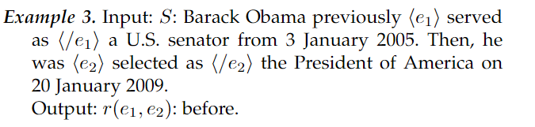

# 论文概述
## 知识图谱发展过程

## EKG的表示方法

示例：

示例：这边给定了两个文本序列，将之处理成时间事件和关系

脚本时序关系  

示例：
  
a customer eating food in a restaurant

## 构建过程

1. 事件抽取
2. 事件关系抽取
3. 事件共指解析
4. 事件论元补全
### 事件抽取
1. 定义

示例：

2. 抽取方式
   1. 有预定义的情况
   
   2. 无预定义的的情况
   
3. 从处理类型上分类：
   1. 句子级别事件抽取：目的是在一个句子中提取事件的触发词和论元。
   2. 文档级事件抽取：句子级事件提取假设事件触发词及其论元在同一个句子中。然而，在真实的场景中，它们通常分散在文档中的多个句子中。因此要进行文档级事件抽取。
   3. 开放域事件抽取：与句子级和文档级事件提取任务不同，开放域事件提取通常没有任何预定义的事件类型或特定的论元角色。它的目标是主要从新闻这样的长文本和社交媒体流这样的短文本中提取事件。

 EKG 构造中引入噪声。此外，由于参数提取的低性能，一些关于 EKG 应用的研究，如脚本事件和时间 KG 预测（参见第 5.1.1 和 5.1.2 节）只考虑更简单的固定参数角色，即主语、宾语和间接对象​​或时间，而不是定义明确的复杂模式。因此，提高这一主要事件提取任务的性能非常重要

### 关系抽取
1. 定义

示例：

特别地，nlp的各个模型的表现良好，比如bert

### 事件消解
1. 定义

2. 处理方法：

### 事件论元补全
1. 定义

2. 示例

3. 运行过程

## 应用的研究

# EVENTSKG: A Knowledge Graph Representation forTop-Prestigious Computer Science Events Metadata
- 上为论文名称
- [论文地址](https://www.researchgate.net/publication/326890754_EVENTSKG_A_Knowledge_Graph_Representation_for_Top-Prestigious_Computer_Science_Events_Metadata_10th_International_Conference_ICCCI_2018_Bristol_UK_September_5-7_2018_Proceedings_Part_I)
- 数据查询语言 
1. 六个主题：
   1. information systems (IS)
   2. security and privacy (SEC)
   3. artificial intelligence (AI)
   4. computer systems organization (CSO)
   5. software and its engineering (SE)
   6. web (WWW)
2. [URL](http://purl.org/events_ds)
3. [github](https://github.com/saidfathalla/EVENTS-Dataset)
4. [数据展示](https://saidfathalla.github.io/EVENTS-Dataset/EVENTS.html)

# EventKG+TL:基于事件知识图谱的时间线生成
- 跨文化 跨语言
- EventKG+TL Event KG + time line 
1. 组成 kg = (L,E,R)
   1.   L 是一组语言上下文，
   2.   E 是一组节点（即事件或实体）
   3.   R 是一个多重集有向边（即关系）
2. EventKG+TL 功能
   1. 和q最相关的事件
   2. 和q最流行的事件（和1的区别）
   3. 热门事件中和q最相关的事件
   4. 所识别事件的流行度以及它们与查询实体 q 的关系强度在语言上下文中有何不同
3. 生成过程
   1. 生成要素
      1. 查询实体
      2. 给定文本(给定的事件知识图谱)
      3. 事件的关联最大数
      4. 上述问题的标准
         1. 流行程度
         2. 相关强度
         3. 综合
4. 标准的计算公式
   1. 重要参数
      1. countlinks(e,l)：**事件链接计数**，即在语言上下文 l 中指向事件 e 的链接数（通过 eventKG-s:links）
      2. countpair(q,e,l)：对数，即从 q 到 e 的链接数加上 l 中从 e 到 q 的链接数，用 eventKG-s:links 值表示
      3. countmentions(q,e,l)：提及次数，即语言上下文 l 中联合链接到 q 和 e 的句子数，用 eventKG-s:mentions 表示
   2. 计算公式
      1. 流行程度  
      
      2. 相关强度  
      
      3. 综合标准  
        
      ps:其中 阿尔法为0.25 权重w为三分之一
5. 生成结果
http://eventkg-timeline.l3s.uni-hannover.de/timeline/EN/combined/EN,DE,FR,PT,RU/15/2015-01-01/-/Brexit

6. 更新的速度和粒度
（应该是静态导入的数据，比如英国脱欧就是到2018

# event KG + click
- [github地址](https://github.com/saraabdollahi/EventKG-Click)
1. 现有问题，跨语言的数据集的构建的分析都是缺失的
2. 很多议题的讨论对语言有高度相关性

> 如上图所示asain games 和英语的相关性就比较高

# open event KG 
- [官网](https://cleopatra-project.eu/index.php/open-event-knowledge-graph/)
1. 主要内容
   1. 七个数据集
   2. 三个简单应用
   3. 