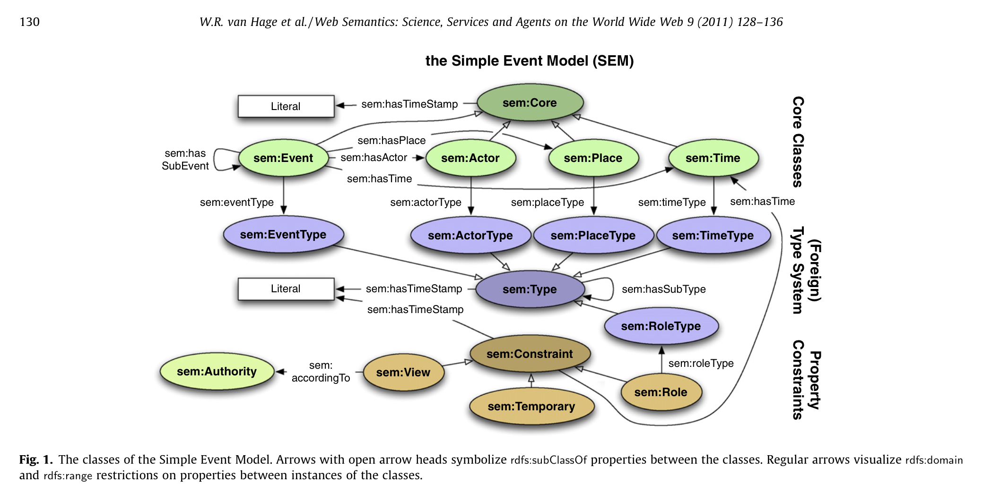

1. 论文名称： Design and use of the Simple Event Model（设计和使用简单的事件模型
2. SEM的逻辑结构图

4. SEM的局限性
	1. 在实体作为主体的情况下，不可能对事件和实体之间的时间关系进行建模。
	>例如，不能直接模拟巴拉克奥巴马参加“巴拉克奥巴马第二次就职典礼”事件的事实，因为“巴拉克奥巴马”实体在这种关系中扮演了主体角色

	2. 两个实体之间的关系不能直接被建模
	> 例如，两个实体之间的关系：婚姻（其原因是用来描述婚姻的有两种方法，第一种是创建
