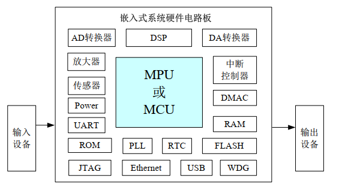
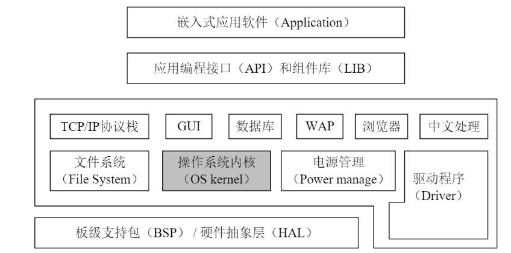
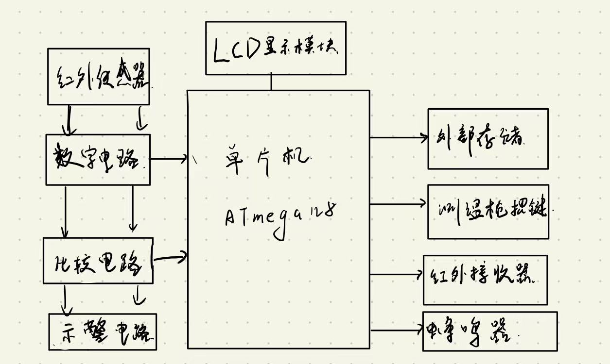
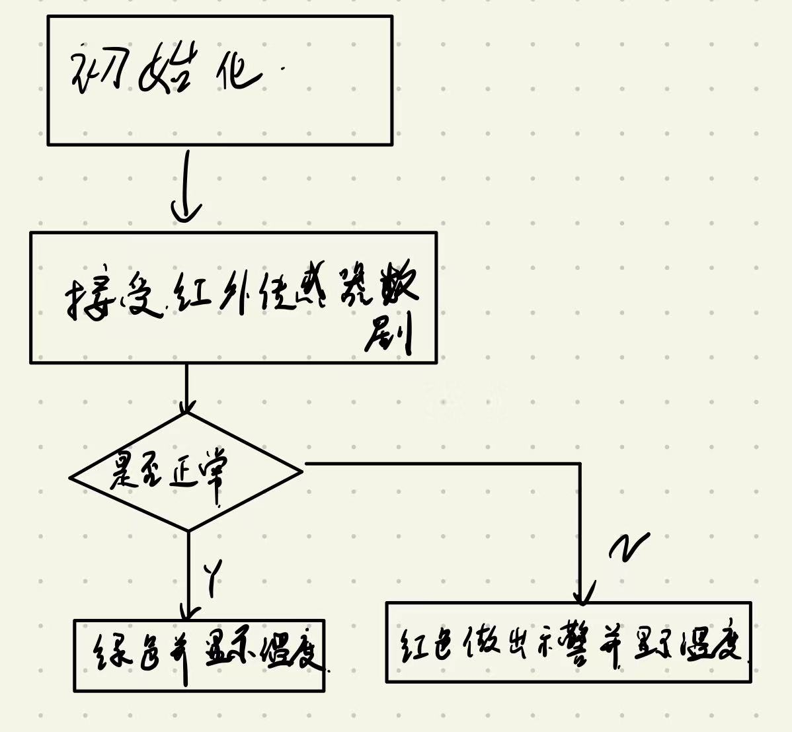

# 嵌入式系统概述
- 姓名：杨佩贤
- 学号：20281158
- 时间：2022.9.14

## 嵌入式系统的基本组成
### 组成机构

- 一个嵌入式系统是一个软硬件的结合体，嵌入式计算机以嵌入式系统的形式隐藏在各个装置、产品和系统当中，其数量远远超过了通用计算机
1. 硬件部分
	1. 嵌入式处理器
	2. 外围电路
	3. 外部设备
2. 软件部分
	1. 操作系统
	2. 应用程序
	

> 硬件部分的组成逻辑如图所示

> 软件结构的组成逻辑如图所示

### 嵌入式系统的示例

> 上图是一个测温枪的图片，接下来将对测温枪进行分析

测温枪的主要功能就是根据红外检测的结果做出温度的检测并进行警示，主要的输入就是红外检测器，输入是LED面板已经温度异常时发出警报的蜂鸣器。

> 上图即为测温枪的硬件逻辑关系

> 上图即为测温枪软件的工作过程

## 物联网及案例
### 物联网
- 物联网的定义是通过[射频识别](https://baike.baidu.com/item/%E5%B0%84%E9%A2%91%E8%AF%86%E5%88%AB/2510798?fromModule=lemma_inlink)、[红外感应器](https://baike.baidu.com/item/%E7%BA%A2%E5%A4%96%E6%84%9F%E5%BA%94%E5%99%A8/9989923?fromModule=lemma_inlink)、[全球定位系统](https://baike.baidu.com/item/%E5%85%A8%E7%90%83%E5%AE%9A%E4%BD%8D%E7%B3%BB%E7%BB%9F/1240960?fromModule=lemma_inlink)、[激光扫描器](https://baike.baidu.com/item/%E6%BF%80%E5%85%89%E6%89%AB%E6%8F%8F%E5%99%A8/10886440?fromModule=lemma_inlink)等信息传感设备，按约定的协议，把任何物品与互联网相连接，进行信息交换和通信，以实现对物品的智能化识别、定位、跟踪、监控和管理的一种网络
### 智能家居
- 作为物联网的一个典型示例：智能家居在很多家庭中已经完成了布置，给我们的生活带来了极大的便利。智能家居通过物联网技术将家中的各种设备（如音视频设备、[照明系统](https://baike.baidu.com/item/%E7%85%A7%E6%98%8E%E7%B3%BB%E7%BB%9F?fromModule=lemma_inlink)、窗帘控制、空调控制、[安防系统](https://baike.baidu.com/item/%E5%AE%89%E9%98%B2%E7%B3%BB%E7%BB%9F?fromModule=lemma_inlink)、数字影院系统、[影音服务器](https://baike.baidu.com/item/%E5%BD%B1%E9%9F%B3%E6%9C%8D%E5%8A%A1%E5%99%A8?fromModule=lemma_inlink)、[影柜](https://baike.baidu.com/item/%E5%BD%B1%E6%9F%9C?fromModule=lemma_inlink)系统、网络家电等）连接到一起，提供家电控制、照明控制、电话远程控制、室内外遥控、防盗报警、[环境监测](https://baike.baidu.com/item/%E7%8E%AF%E5%A2%83%E7%9B%91%E6%B5%8B?fromModule=lemma_inlink)、暖通控制、红外转发以及可编程定时控制等多种功能和手段。与普通家居相比，智能家居不仅具有传统的居住功能，兼备建筑、网络通信、信息家电、设备自动化，提供全方位的信息交互功能，甚至为各种能源费用节约资金

近些年来，我们常常能看到如小米公司小爱同学能智能家居方面的的发展

> 智能家居图示

## 嵌入式系统的设计
### 研究背景
作为一名业余健身爱好者，近些年来健身房发生的安全事件屡见不鲜，特别是在没有人保护的情况下，健身小白很容易出现问题。

>  就如上图所示，在练腿时膝盖锁死之后，巨大的压力直接压垮了左边的小腿和膝盖

### 人体膝盖部分嵌入式设备
1. 故我想要一个设计一个布置在膝盖部分的嵌入式设备，来作为健身时安全的有效保护，大概的设想是在人体膝盖部分布置这个设备，可以接收和检测膝盖的受力情况，在危险的时候立刻发出警报，给人体的膝盖一定程度的支撑；同时该设备应该还可以向健身器材发送信号，健身器材可以接受这个信号并且紧急制动。
2. 技术难点
	1. 在膝盖部分有效的受力检测
	2. 因为这样的事故的发生往往在一瞬间，所以对该设备的响应速度有着很高的要求。

